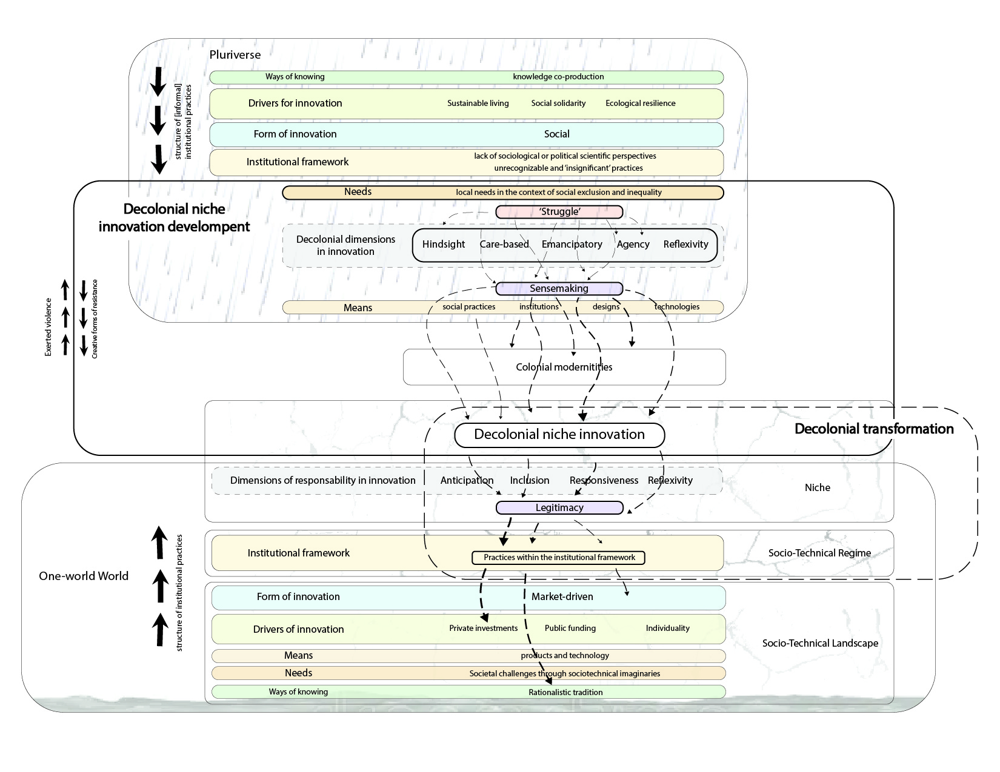

## About me

> _I'm a transdisciplinary professional working at the intersection of urban innovation, environmental governance, and systemic design. My background spans Europe and Latin America, where I've developed expertise in translating between research, design, and policy to unlock sustainable transitions._
>
> _I solve complex problems by understanding real constraints and identifying where leverage exists in a system. Rather than applying generic solutions, I design, implement, and measure interventions that work within actual governance structures and stakeholder dynamics._
>
> _My work across México, France, and the Netherlands has taught me that systemic change happens when you see problems at multiple scales simultaneously and create conditions for different actors to collaborate. I'm driven by the challenge of turning complex sustainability and governance problems into tangible, measurable outcomes._

> 

##### Reach out through [Linkedin](https://www.linkedin.com/in/juan-jose-corona/) or, if you want to learn about one of my hobbies, click [here](https://www.instagram.com/jjclucio).

---

# Facilitation & Collective Mobilisation

### [Picking Up De Wallen: Utilizing Toxic Tours as Research-Driven Tourism and Stakeholder Engagement](page12.md)

 How do you mobilise diverse groups around complex, uncomfortable urban challenges? This thesis used toxic tours in Amsterdam's Red-Light District to turn waste (a problem people avoid) into a shared object of inquiry, demonstrating how designed experiences can shift collective understanding from individual responsibility to systemic accountability.

> 

### [Clean Inner City Living Lab](page-1.md)

A collaborative field investigation into waste perception and management in De Wallen, Amsterdam. Working with residents, workers, and municipal stakeholders, the project produced a system map and typology matrix that gave policymakers a visual tool to understand how the waste system actually operates on the street, bridging the gap between designed infrastructure and lived reality.

> 

# Systems Research & Urban Governance

### [The Ex[cease]tance](page2.md)

A spatial and institutional analysis of burial infrastructure in Amsterdam, examining how urban planning decisions embed cultural hierarchies and remove death from everyday life. The work maps the intersection of religious belief, logistical operations, and colonial inheritance embedded in how cities manage bodies.

> 

### [Raindrops of Change](page3.md)

A decolonial approach to infrastructure and technological development, centring non-Western knowledge systems as legitimate frameworks for niche innovation and sustainable transitions.

> 

_____

_Thanks for stopping by! I'm always open to new ideas, and good conversations_
