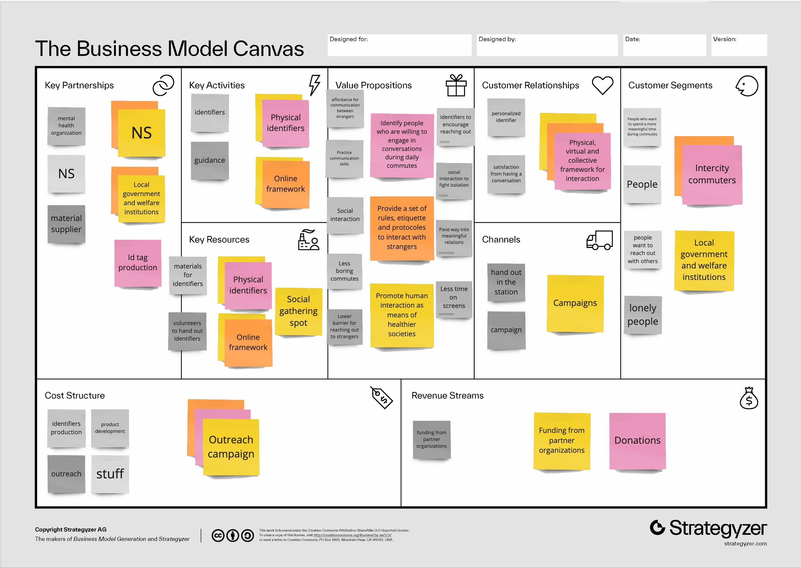

## About me

> _Systems thinker and occasional overcomplicator. I like to think about the broad systems in the world and understand how they impact us as different scales. Come take a look at my work._
>
> _Three artifacts are shown here, each one is a system I tried to understand well enough to make useful to someone else. The one-sentence summary below tells you what decision it enabled._
>
> _If you're curious about how it actually happened, the detours, and the redesigns, click through!_
>
> 

##### Reach out through [Linkedin](https://www.linkedin.com/in/juan-jose-corona/) or, if you want to learn about one of my hobbies, click [here](https://www.instagram.com/jjclucio).

---
# Artifacts

## [System map of the waste ecosystem in Amsterdam's Red Light District](page-1.md)

This system map gave Amsterdam municipal stakeholders, and TU Delft and Wageningen researchers, a shared visual reference for how the waste system actually functions on the street, closing the gap between designed infrastructure and lived reality informing both intervention priorities and the conditions needed to scale applied research solutions.

> <iframe src="https://embed.kumu.io/c8831c515a7c4d2023fd3150483cdd0e" width="500" height="400" frameborder="0"></iframe>

 

## [Framework for mobilizing stakeholders around complex urban challenges](page12.md)

This framework used embodied, place-based methods across nine iterations of a critical walking tour that produced a five-pattern learning model, demonstrating how structured hands-on inquiry shifts participants from individual to systemic understanding of complex urban challenges.

> 
> 
##### _Toxic tour structure in accordance to KAOSPILOT's Learning Arches methodology_

 

## [Business Model Canvas (BMC) evolution through interview patterns](page6.md)

Business Model Canvas evolution made visible how interview insights (users motivated by casual connection and boredom-relief, not loneliness) contradicted initial strategy, enabling pivot from mental-health to happiness-focused interaction framing with corresponding alignment across product, value proposition, and market positioning.

> 
 
 

_Happy to tell you more about my work and other projects in person!! :)_
