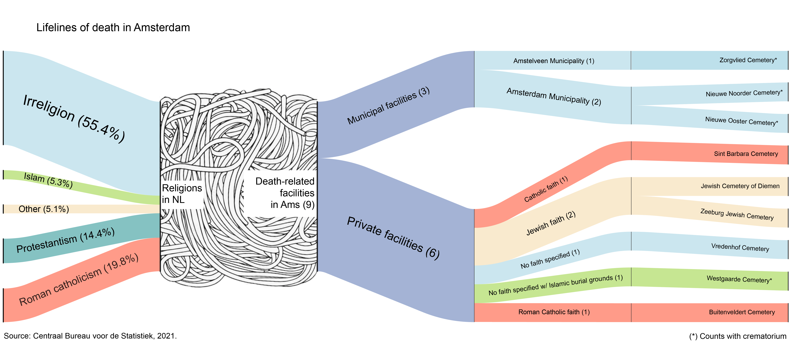

## About me

> _Systems thinker and occasional overcomplicator. Come take a look at my work._
>
> _Three artifacts are shown here, each one is a system I tried to understand well enough to make useful to someone else. The one-sentence summary below tells you what decision it enabled._
>
> _If you're curious about how it actually happened, the detours, and the redesigns, click through!_
>
> 

##### Reach out through [Linkedin](https://www.linkedin.com/in/juan-jose-corona/) or, if you want to learn about one of my hobbies, click [here](https://www.instagram.com/jjclucio).

---
## [Artifact 1: System Map](page-1.md)
### [Project: Clean Inner City Living Lab](page-1.md)

This system map gave Amsterdam municipal stakeholders, and TU Delft and Wageningen researchers, a shared visual reference for how the waste system actually functions on the street, closing the gap between designed infrastructure and lived reality informing both intervention priorities and the conditions needed to scale applied research solutions.

> <iframe src="https://embed.kumu.io/c8831c515a7c4d2023fd3150483cdd0e" width="570" height="400" frameborder="0"></iframe>
> 
>
---
## [Artifact 2: Participatory Research Framework](page12.md)
### [Picking Up De Wallen: Utilizing Toxic Tours as Research-Driven Tourism and Stakeholder Engagement](page12.md)

A participatory action research framework using embodied, place-based methods across nine iterations of a co-designed critical walking tour that produced a five-pattern learning model, demonstrating how structured hands-on inquiry shifts participants from individual to systemic understanding of complex urban challenges.

> 
> 
##### _Toxic tour structure in accordance to KAOSPILOT's Learning Arches methodology_
---
## [Artifact 3: System and Flow Diagrams](page2.md)
### [Project: Reevaluating Death-Related Institutions in the Dutch Context](page2.md)

A multi-system analysis mapping spatial, logistical, and cultural interdependencies in Amsterdam's burial infrastructure that surfaced structural inequities invisible to standard urban planning frameworks, enabling identification of leverage points where governance redesign and ecological alternatives intersect.

> 
>
>  
_____

_Thanks for stopping by! I'm always open to new ideas, and good conversations_
