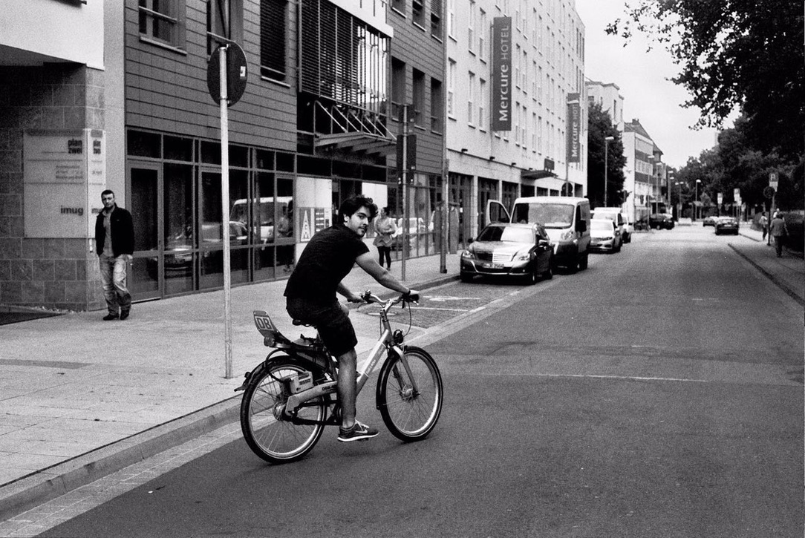

## Clean Inner City Living Lab
### Schone Binnenstad Living Lab

##### Introduction 

A participatory systems map built from waste perception and management in De Wallen, Amsterdam. Working with +30 stakeholder interviews from residents, workers, and municipal stakeholders, the project produced a system map and typology matrix that gave policymakers and researchers a visual tool to understand how the waste system actually operates on the street, bridging the gap between designed infrastructure and lived reality.

##### Waste Typologies

##### System Map
The research revealed that the municipality does not yet have a visual overview of how the waste system operates in reality and where the challenges lie. This led to create the system map and typology matrix, which seek to translate reality into a physical representation of what is happening on the streets by identifying patterns configurations of trash on the streets and linking them to 30+ stakeholder interviews. It gave municipal and academic partners their first shared reference for Amsterdam's City Center waste ecosystem, enabling identification of leverage points and redirecting the research agenda towards implementation-related questions.

The map was first used as a diagnostic tool with the research team. Rather than presenting findings, it was brought into working sessions as a live reference that researchers could interrogate against their own proposals, surfacing gaps between academic assumptions and operational reality and redirecting work packages toward questions with actual implementation value.

<iframe src="https://embed.kumu.io/c8831c515a7c4d2023fd3150483cdd0e" width="570" height="400" frameborder="0"></iframe> 

The same map was then adapted into a structured presentation for municipality officials, translating the typology framework into a format that supported strategic decision-making. By contextualizing Amsterdam's existing trash strategies within the identified typologies and underlying systemic factors, it enabled officials to assess which approaches were transferable to other parts of the city and which were specific to De Wallen's conditions.

<iframe src="https://jjcoronal.kumu.io/system-map-tool" width="712" height="450" frameborder="0"></iframe>

[back](./)
