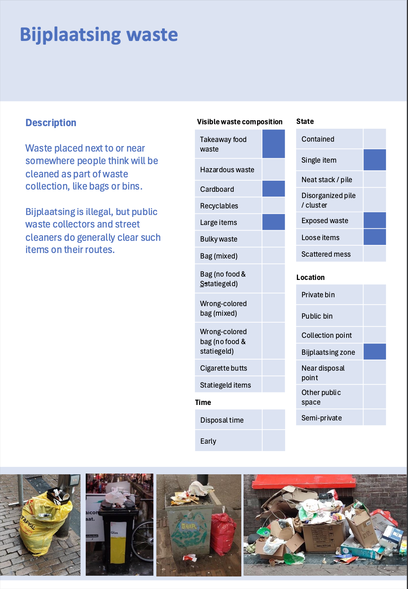
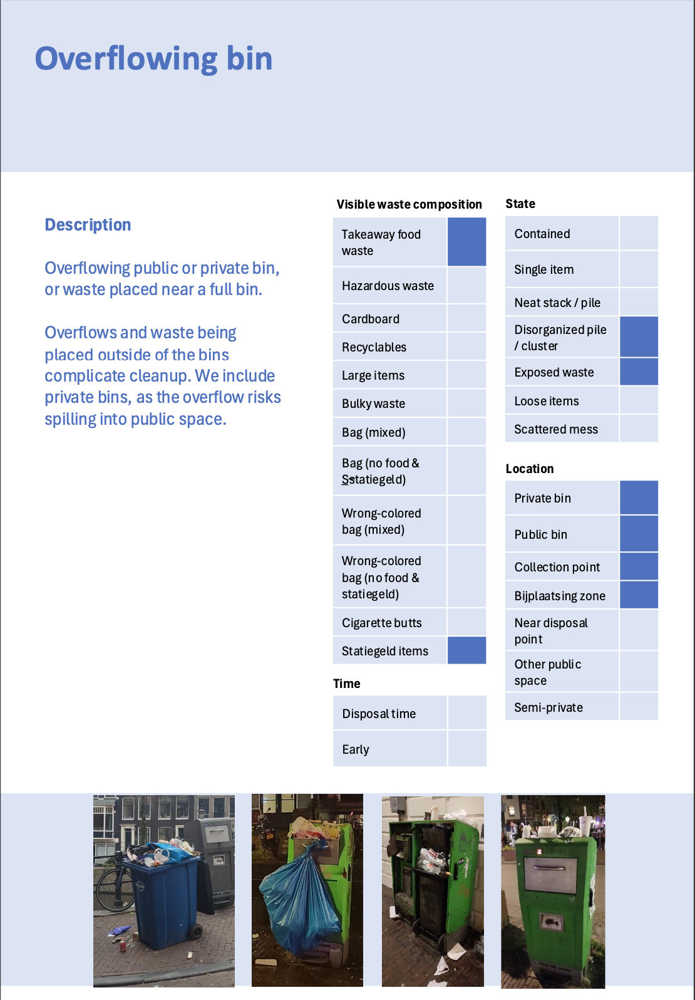
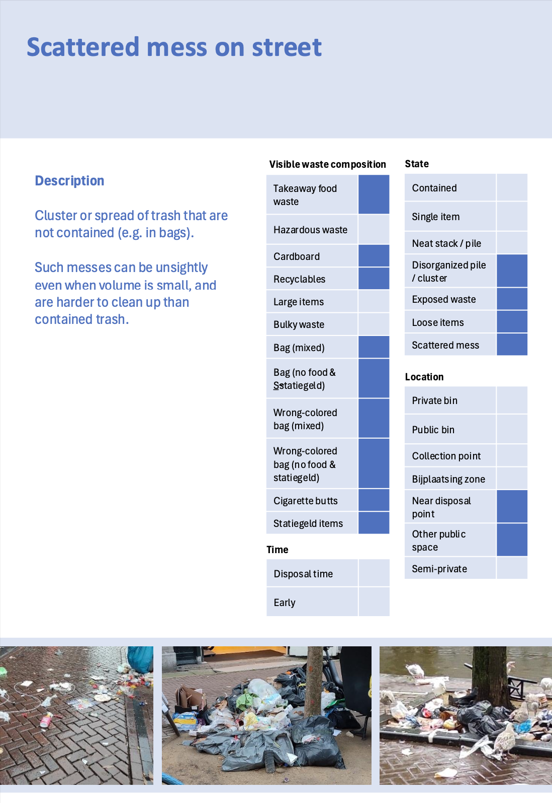
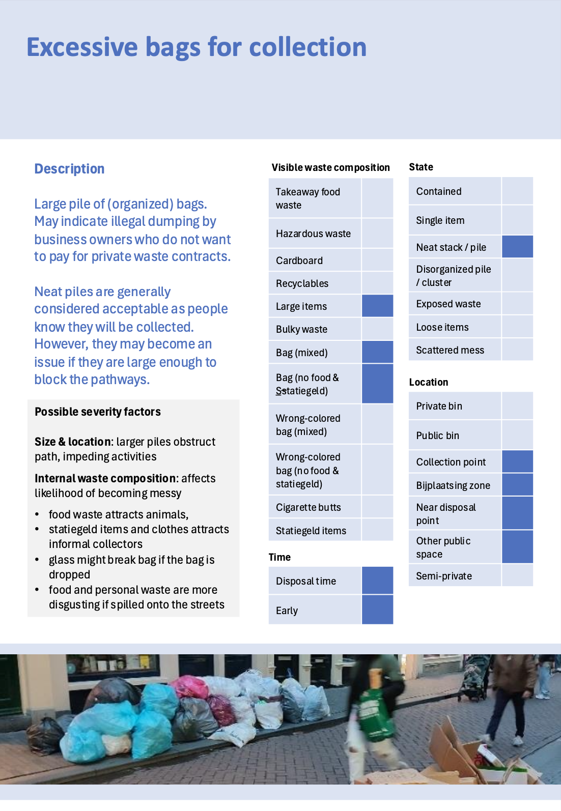

## Clean Inner City Living Lab
### Schone Binnenstad Living Lab

A participatory systems map built from waste perception and management in De Wallen, Amsterdam. Working with +30 stakeholder interviews from residents, workers, and municipal stakeholders, the project produced a system map and typology matrix that gave policymakers and researchers a visual tool to understand how the waste system actually operates on the street, bridging the gap between designed infrastructure and lived reality.

##### Waste Typologies

Ten waste typologies were classified into a visual framework that mapped each type to its systemic drivers, operational constraints, and governance gaps within Amsterdam's inner city waste ecosystem. Below are some examples of how they were grouped and evaluated across the project.

##### System Map
The research revealed that the municipality does not yet have a visual overview of how the waste system operates in reality and where the challenges lie. This led to create the system map and typology matrix, which seek to translate reality into a physical representation of what is happening on the streets by identifying pattern configurations of trash on the streets and linking them to 30+ stakeholder interviews. It gave municipal and academic partners their first shared reference for Amsterdam's City Center waste ecosystem, enabling identification of leverage points and redirecting the research agenda towards the implementation of solutions through academic research.

The map was first used as a diagnostic tool with the research team and the municipality. It was brought into working sessions as a live reference that researchers could interrogate against their own proposals, surfacing gaps between assumptions and operational reality and redirecting work packages toward questions with implementation value for the Municipality of Amsterdam.

As the project matured and the problem framing stabilized, more granular scales of analysis became reachable. It then absorbed new findings, and progressively pressure-tested each research proposal against ground-level conditions as they emerged. Altogether the map identified synergies, gaps, leverage points, and risks across work packages, maximizing impact and reducing the chances of isolated failure from each of the experiments to be tested.

<iframe src="https://embed.kumu.io/c8831c515a7c4d2023fd3150483cdd0e" width="570" height="400" frameborder="0"></iframe> 

[back](./)
