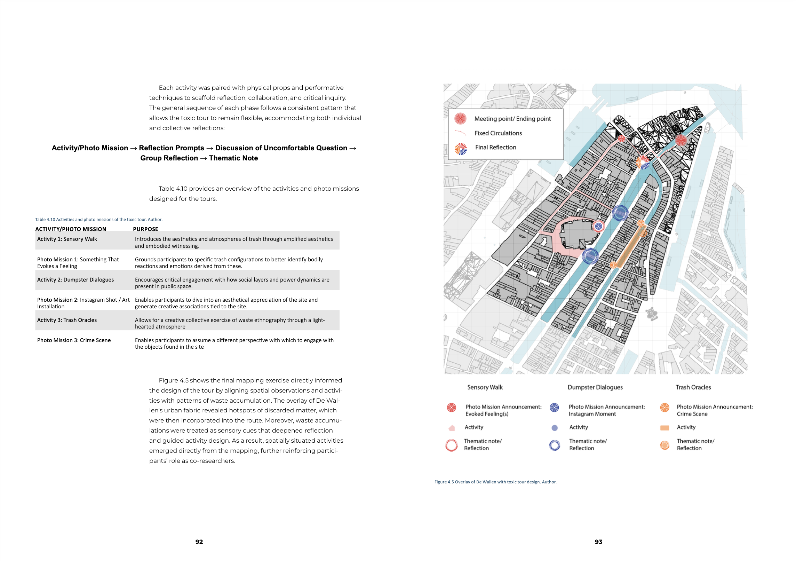
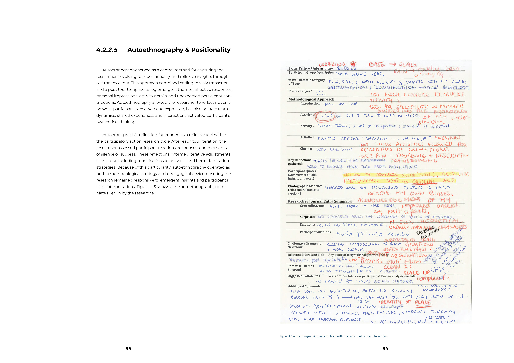
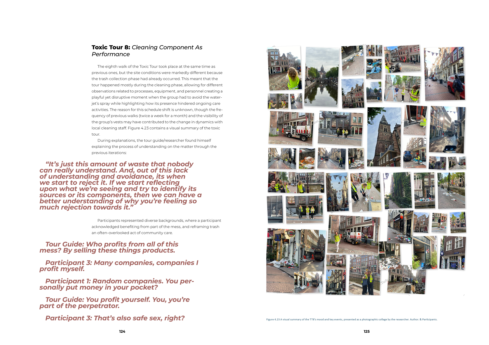

## Picking Up the Red-Light District:
### Utilizing Toxic Tours as a method for Research-Driven Tourism and Stakeholder Engagement in addressing waste in the De Wallen District

A research methodology designed as a participatory sensemaking process: nine critical walking tours through De Wallen, structured across three co-creation phases, using tourism as both the medium and the object of inquiry.

#### Cover

#### Prologue

#### Problem contextualization

#### Conceptual models

#### Methodology 

#### Operationalization

Documents how participants were positioned as co-researchers, not subjects, and how the researcher's own positionality was made visible as part of the sensemaking process.

##### Activity and photo mission structuring

##### Autoethnography and positionality

#### Walk results 

#### Epilogue 

  

[back](./)

