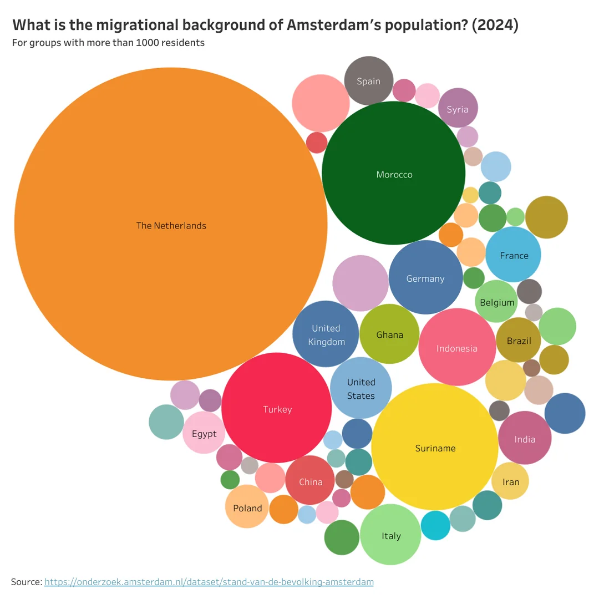
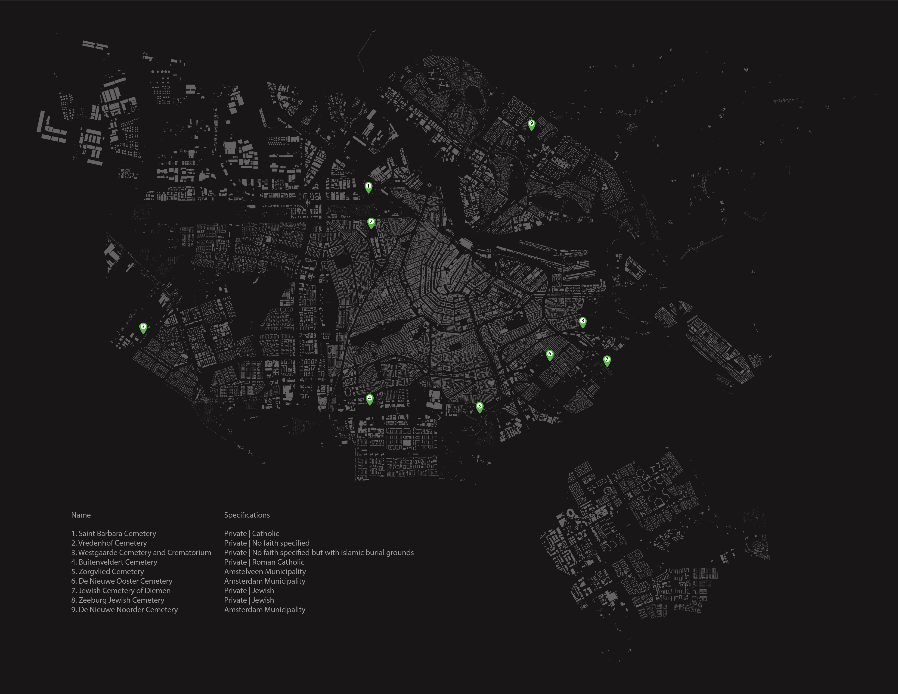
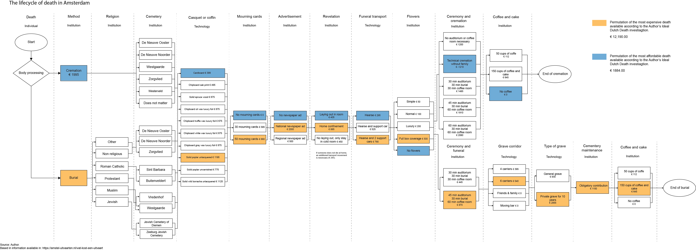

## Reevaluating Death-Related Institutions in the Dutch Context
### The work at hand mapped intersecting logistical, institutional, and cultural systems to surface structural barriers to alternative burial practice adoption, enabling course team to identify leverage points for policy intervention.

As of 2024 Amsterdam has 1,182,000 inhabitants and 180 different nationalities

> 

The illustrates below shows the scarcity and spatial distribution of cemeteries in Amsterdam, where emeteries are predominantly located in peripheral areas because of high urban density and limited land availability. As a cosnequence burial practices are pushed away from the urban fabric and daily life. This spatial marginalization reflects a broader societal tendency to remove death from cotidianeity, treating it as an exceptional event rather than an integrated part of human experience. 

> 

The following Sankey diagram maps the movement of human bodies within burial processes, illustrating the intersection between religious beliefs, logistical operations, and spatial infrastructures. It also acknowledges the entanglement of decisions taken by people due to disparities in burial accessibility and the persistence of colonial systems in death-related logistics.

> 

A flow diagram mapping out the death and burial industry reveals how the process is structured into phases, the decisions involved, the associated expenses, and the emotional & financial pressure it imposes on grieving relatives—especially when arrangements have not been previously discussed.

[back](./)
