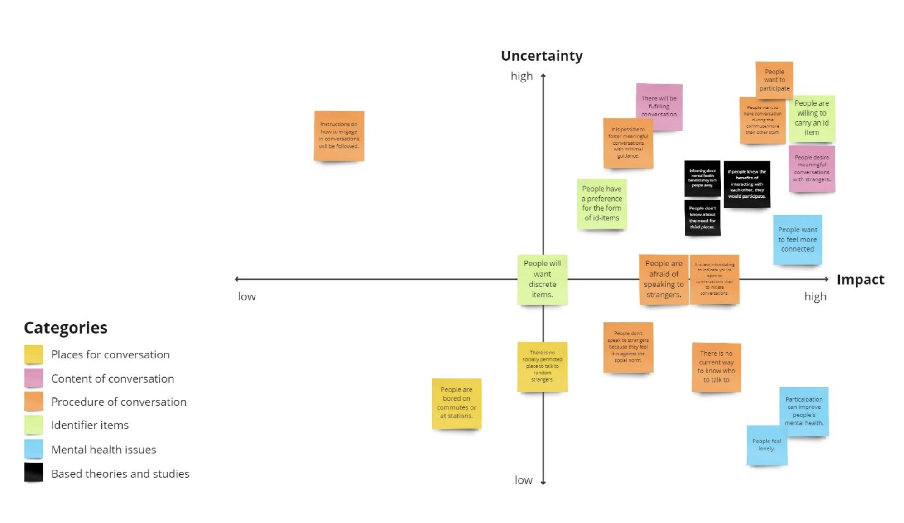
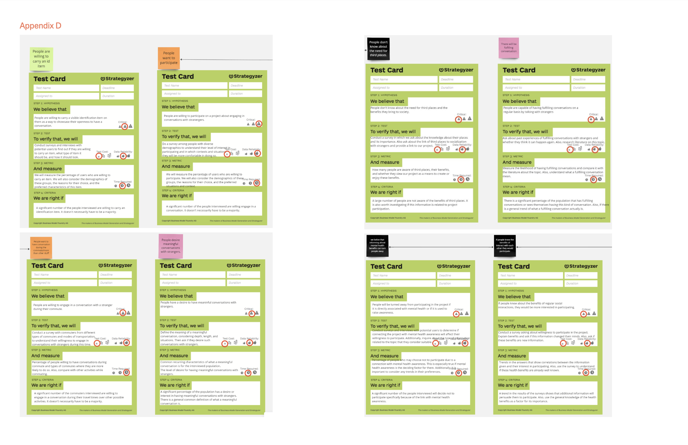
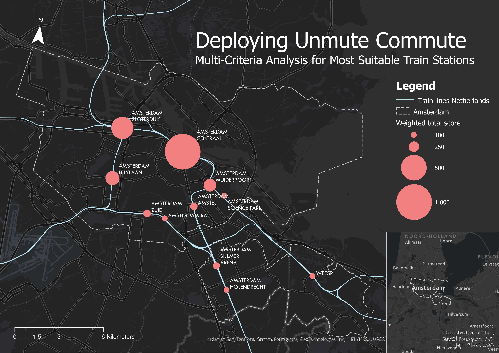
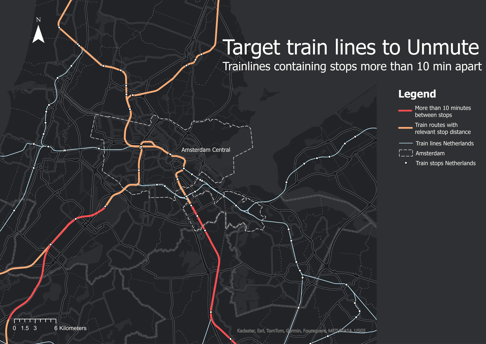
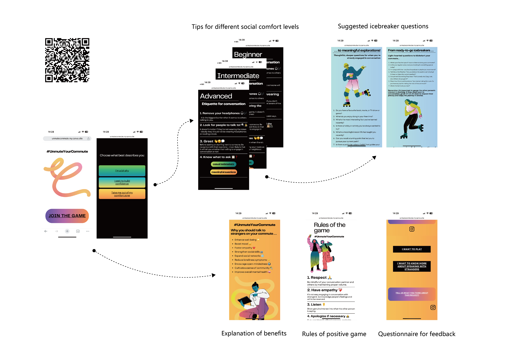

# Designing Social Infrastructure for Commuters

A four-week entrepreneurial sprint demonstrating how constraint-based iteration refines problem definition and aligns strategy. Initial user research invalidated the core assumption (travel disruptions as a problem for cyclists), forcing a methodological pivot: reframe the constraint, rebuild the hypothesis, and validate through rapid prototyping. The project illustrates the transition from assumption-driven design to insight-driven strategy, ending with a validated product ready for deployment. The work showcases systems thinking in complexity, collaborative alignment across misaligned stakeholders, and visual frameworks that enable strategic decision-making.

### Primary Artifact: Business Model Canvas Evolution

Research pattern analysis across 11 interviews revealed user motivation misalignment (boredom and surface-level connection, not loneliness), triggering strategic pivot from 'address loneliness' to 'foster happiness through casual interaction.' BMC evolution made this shift visible across product, value proposition, customer segments, and revenue model, enabling coherent cross-functional alignment on interdependent strategic changes.

### Supporting Analysis

The assumption grid (below) identified which uncertainties were worth testing through research. Rather than validating every assumption equally, the framework revealed that user motivation, whether people actually wanted to talk to strangers, was both high-uncertainty and high-impact. This focused research effort.

 

Interview patterns (11 respondents across commuters and strangers) showed consistent findings: people engaged in spontaneous conversation for enjoyment and mental relief, not primarily for addressing loneliness. Many avoided initiation not from fear of rejection, but from not knowing how to begin. This reframed the product from "support mental health" to "enable easy connection."

Market validation used GIS analysis to identify where the product would have the highest chance of adoption stations with passenger volume, frequent disruptions (natural moments of conversation), and existing commuting patterns. Amsterdam Central Station emerged as the optimal launch site.

 

### Implementation Pathway

#### Token (MVP)
A token was developed as the Minimum Viable Product (MVP) in order to put the idea into action. The development og the MVP sparked hinderances during the user journey. Consequently, an [online toolkit](https://unmutecommute.my.canva.site/unmutecommute) was developed as an digital complement of the MVP to unmute people's commute.

 

[back](./)
